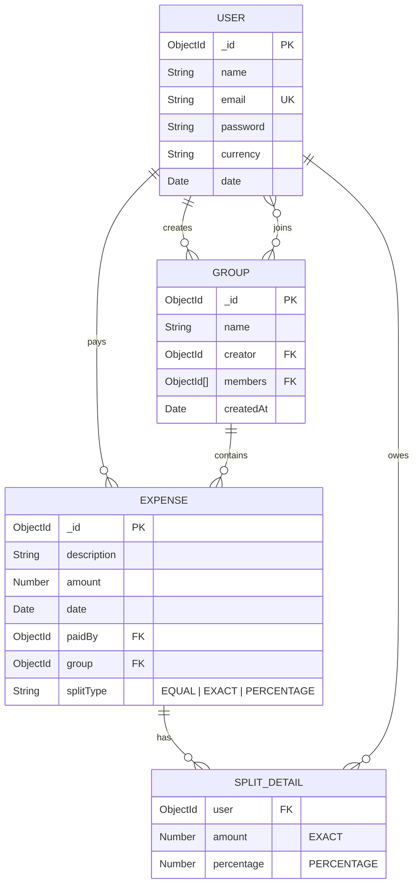

```mermaid
erDiagram
    USER ||--o{ GROUP : creates
    USER }o--o{ GROUP : joins
    USER ||--o{ EXPENSE : pays
    GROUP ||--o{ EXPENSE : contains
    EXPENSE ||--o{ SPLIT_DETAIL : has
    USER ||--o{ SPLIT_DETAIL : owes

    USER {
        ObjectId _id PK
        String name
        String email UK
        String password
        String currency
        Date date
    }

    GROUP {
        ObjectId _id PK
        String name
        ObjectId creator FK
        ObjectId[] members FK
        Date createdAt
    }

    EXPENSE {
        ObjectId _id PK
        String description
        Number amount
        Date date
        ObjectId paidBy FK
        ObjectId group FK
        String splitType "EQUAL | EXACT | PERCENTAGE"
    }

    SPLIT_DETAIL {
        ObjectId user FK
        Number amount "EXACT"
        Number percentage "PERCENTAGE"
    }
```